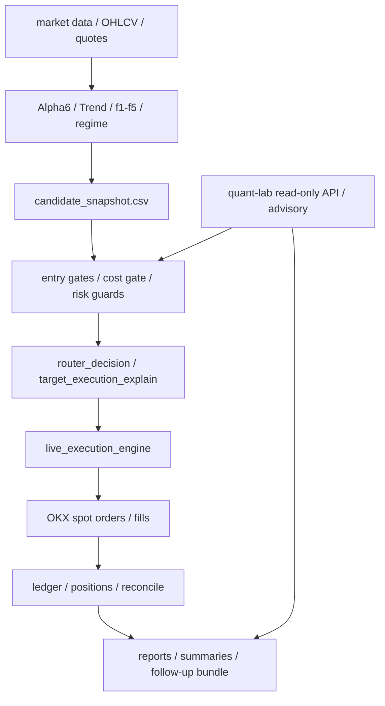

# V5-prod 实盘交易系统

V5-prod 是运行在 OKX 现货市场上的生产级量化交易系统。它负责真实下单、成交记录、仓位状态、风控、对账和生产诊断。系统现在的定位很清楚：V5 是执行端，quant-lab 是只读研究中台；paper、shadow、advisory、专家包和 dashboard 都只能提供证据，不能绕过 V5 的 live gate。

当前代码重点不是“多交易”，而是把每一次买、不买、卖、不卖都解释清楚，并把成本、滑点、负期望、swing 退出、paper 策略和中台 advisory 的影响全部留痕。

## 核心原则

- **真实订单只由 V5 发出**：quant-lab、paper tracker、shadow report、bundle exporter 都不能产生真实订单。
- **只在白名单 universe 内 live**：扩展币种可以 paper/shadow，但不能自动加入 live symbols。
- **PROTECT 优先**：小账户下，宁愿漏单，也不允许弱确认、高成本、负期望或状态不一致的订单静默进入实盘。
- **成本必须可解释**：OPEN_LONG 使用 roundtrip all-in cost，并和本地成本 floor 比较。
- **诊断不改变交易**：新增 backtest、Alpha6 conflict、BNB recovery、risk-on multi-buy、bottom-zone 等输出均为 read-only。
- **生产版本必须可追踪**：bundle manifest 应显示 clean git provenance，dirty worktree 会进入 data quality warning。

## 当前生产边界

默认 live universe：

```text
BTC/USDT
ETH/USDT
SOL/USDT
BNB/USDT
```

可观察但不 live 的范围：

- HYPE/WLD/TRX/SUI 等 expanded universe advisory。
- Alpha Factory second-stage candidates。
- risk-on multi-buy top1/top2/top3 shadow。
- BNB strong Alpha6 bypass shadow。
- bottom-zone / pullback / late-entry / missed-low 研究。

这些输出的 `live_order_effect` 必须是：

```text
read_only_no_live_order
```

## 主链路



关键运行输出：

```text
reports/runs/<run_id>/decision_audit.json
reports/runs/<run_id>/candidate_snapshot.csv
reports/runs/<run_id>/trades.csv
reports/runs/<run_id>/summary.json
reports/runs/<run_id>/order_lifecycle.csv
reports/candidate_snapshot.csv
reports/order_lifecycle.csv
reports/skipped_candidate_labels.jsonl
reports/sol_paper_strategy_labels.jsonl
reports/negative_expectancy_cooldown.json
```

## 配置基线

主要配置文件：

```text
configs/live_prod.yaml
```

生产默认：

- ML live overlay disabled。
- `execution.collect_ml_training_data=false`。
- `execution.ml_research_use_stable_universe=false`。
- split order runtime inactive。
- `enable_live_small_from_quant_lab=false`。
- quant-lab guard 当前只做 observe/shadow/report，不默认控制 live。
- expanded universe 只允许 paper/shadow，不改变 live symbols。

生产依赖与研究依赖拆分：

```text
requirements.txt
requirements-research.txt
```

生产启动不应强制 import xgboost / scikit-learn。研究脚本缺少依赖时应提示安装 `requirements-research.txt`。

## 信号与候选

### Alpha6

Alpha6 是当前 V5 最重要的确认信号之一。典型字段：

```text
alpha6_score
alpha6_side
f3_vol_adj_ret
f4_volume_expansion
f5_rsi_trend_confirm
```

PROTECT 下，普通 OPEN_LONG 不能只靠趋势强度通过，通常还需要 Alpha6 buy、f4/f5 确认、成本覆盖和负期望检查。

### final_score vs Alpha6 conflict

V5 会输出：

```text
summaries/final_score_vs_alpha6_conflict.csv
```

用于审计以下场景：

- `alpha6_side=buy`
- `alpha6_score>=0.9`
- `expected_edge_bps > required_edge_bps`
- `cost_gate_verified=true`
- `final_score<0` 或 `final_decision in [no_order, blocked]`

报告会记录 4h/8h/12h/24h 后验收益、`max_future_net_bps`、`best_future_horizon_hours`、`material_profit_flag`。它只回答“旧 final_score 或负期望是否压制了强 Alpha6 机会”，不改变 live。

### BNB strong Alpha6 bypass shadow

输出：

```text
summaries/bnb_strong_alpha6_bypass_shadow.csv
```

触发条件：

- `symbol=BNB/USDT`
- `alpha6_side=buy`
- `alpha6_score>=0.9`
- `expected_edge_bps > required_edge_bps`
- `cost_gate_verified=true`
- `f4_volume_expansion>=1.0` 或 `f3_vol_adj_ret>=10`

该 shadow 用于观察“如果绕过负期望或旧 final_score，后续是否赚钱”。它永远不产生真实订单。

## PROTECT 与 entry guard

PROTECT 是 V5 小账户 live 的核心保护层。

常见 guard：

- Alpha6 / f4 / f5 entry gate。
- cost-aware edge gate。
- negative expectancy cooldown。
- protect alt short-cycle negative expectancy。
- same-symbol re-entry cooldown。
- candidate cost trust diagnostics。
- quant-lab permission/cost shadow diagnostics。

`target_execution_explain` 需要区分：

- gate 已评估且通过；
- gate 已评估且失败；
- 因更早 hard guard 被拦而未评估。

如果订单在 `protect_alt_short_cycle_negative_expectancy`、`negative_expectancy_cooldown`、`same_symbol_reentry_cooldown` 或 `cost_aware_edge` 等 prior guard 被拦，`passed_protect_entry_gate` 不应显示为 true。

## Cost 与 Quant Lab

V5 使用 quant-lab cost response 时必须采用 roundtrip all-in cost：

```text
selected_entry_gate_cost_bps =
  max(response.roundtrip_all_in_cost_bps,
      cfg.execution.cost_aware_roundtrip_cost_bps)
```

candidate snapshot 会保留：

```text
one_way_all_in_cost_bps
roundtrip_all_in_cost_bps
selected_entry_gate_cost_bps
cost_quality
cost_trusted_for_paper
cost_trusted_for_live
cost_source_quality
candidate_cost_trusted
degraded_cost_model
cost_resolution_reason
```

不再允许 public spread proxy 直接覆盖本地 roundtrip floor。

Quant-lab 当前是研究/审计/paper/shadow 系统，不是 live commander。默认：

```text
guard_enforced=false
enable_live_small_from_quant_lab=false
```

`summaries/live_guard_impact.csv` 用于观察如果启用中台 guard 会拦哪些单，但不会改变 `final_decision_actual`。

## Candidate Snapshot

每个 live run 都必须输出：

```text
candidate_snapshot.csv
```

每个当前 universe symbol 至少一行，即使没有订单也要输出：

```text
final_decision=no_order
block_reason / no_signal_reason
```

必须覆盖成本字段，blocked/no_order candidate 也不能长期空白。BNB/SOL/BTC 等 no_order candidate 应优先使用 symbol-level cached Quant Lab cost 或 latest symbol cost table，不能直接退回 global default，除非明确 symbol missing / service unavailable。

## Swing 持仓与退出保护

`swing_hold_position=true` 的仓位有最小持仓语义。若：

```text
hold_hours < swing_min_hold_hours
exit_priority=soft
```

则 soft CLOSE_LONG 应被阻止。ATR trailing 在 min-hold 内默认属于 soft exit。

允许的 hard exit：

```text
max_loss_hard_stop
emergency_close
exchange_risk
risk_off_force_exit
position_reconcile_force_close
zero_target_close
```

audit 字段：

```text
swing_min_hold_guard_checked
swing_min_hold_guard_blocked
soft_exit_blocked_by_min_hold
hard_exit_exception_reason
hold_hours_at_exit_check
swing_min_hold_hours
would_exit_shadow
blocked_exit_reason=swing_min_hold_soft_exit_blocked
```

### f3-dominant swing guard

f3 主导但 f4/f5 弱的候选可以继续按普通 entry 评估，但不能享受 swing min-hold 保护。

输出：

```text
summaries/f3_dominant_swing_guard_cases.csv
summaries/f3_dominant_swing_guard_outcomes.csv
```

## Negative Expectancy 与亏损归因

negative expectancy 以 closed cycle 为基础，窗口过滤按 `close_ts`，不是 entry_ts。

对 premature swing soft exit 做特殊处理：

- 保留 raw realized loss。
- 不计入 fast-fail hard block。
- 输出 premature / excluded count。

新增 attribution 会区分：

```text
entry_bad
exit_bad
min_hold_violation
gave_back_profit
trailing_too_early
unknown
exit_metadata_missing
```

protect alt short-cycle audit 会输出：

```text
entry_bad_cycles
exit_bad_cycles
min_hold_violation_cycles
gave_back_profit_cycles
trailing_too_early_cycles
adjusted_entry_expectancy_bps
raw_would_block
adjusted_would_block
would_unblock_if_adjusted
block_attribution_conflict
```

第一阶段不改变 block 行为，只输出审计。

## Paper / Shadow 体系

### SOL / ETH / BNB paper

当前 paper strategy 输出：

```text
summaries/paper_strategy_runs.csv
summaries/paper_strategy_daily.csv
summaries/paper_slippage_coverage.csv
summaries/bnb_paper_strategy_runs.csv
summaries/bnb_paper_strategy_daily.csv
```

已支持：

```text
SOL_PROTECT_ALPHA6_LOW_EXCEPTION_PAPER_V1
SOL_F4_VOLUME_EXPANSION_PAPER_V1
ETH_USDT_F3_DOMINANT_ENTRY_PAPER_V1
BNB_F3_DOMINANT_ENTRY_PAPER_V1
BNB_RISK_ON_BUY_PAPER_V1
```

所有 paper 策略都必须保留：

```text
live_order_effect=read_only_no_live_order
```

ETH f3 paper 必须要求 `alpha6_side=buy` 才能 `would_enter=true`。`alpha6_side=sell` 时不计入 entry_count。

### Expanded universe paper

V5 可以只读 quant-lab advisory 中的 expanded universe PAPER_READY/KEEP_SHADOW/KILL 行。

输出：

```text
summaries/expanded_universe_advisory_reader.csv
summaries/expanded_universe_paper_runs.csv
summaries/expanded_universe_paper_daily.csv
```

HYPE/WLD 等 expanded symbols 不加入 live symbols。若 advisory 带有 future/label 字段，expanded daily 会按 horizon 聚合收益；没有标签时保持 pending/空值，不伪造 PnL。

### Risk-on multi-buy shadow

输出：

```text
summaries/risk_on_multi_buy_shadow.csv
```

V5 优先读取 quant-lab 明细文件：

```text
raw/reports/risk_on_multi_buy_shadow.csv
reports/risk_on_multi_buy_shadow.csv
```

如果明细可用，`selected_symbols` 应显示真实组合，例如 `["BNB-USDT"]` 或 `["BNB-USDT","SOL-USDT"]`。只有只能从 advisory summary 读取且 symbol=MULTI 时，才显示 `not_observable`。

## Probe 与 open probe watch

Probe 是小仓试探，不是普通趋势仓。当前支持：

```text
btc_leadership_probe
market_impulse_probe
```

Probe exit policy：

```text
probe_stop_loss
probe_take_profit
probe_trailing_stop
probe_time_stop
```

active probe 不应被普通 zero-target close 平掉。bundle 输出：

```text
summaries/open_probe_watch.csv
```

用于回答：

- 当前是否有 active probe。
- 浮盈/浮亏。
- 距离 take-profit / stop-loss / trailing / time-stop 还差多少。
- zero-target close 是否被正确保护。

## Order Lifecycle 与交易状态一致性

`order_lifecycle.csv` 必须串起：

```text
decision -> submit -> fill -> trade export -> roundtrip -> position state
```

关键字段：

```text
decision_ts
arrival_bid / arrival_ask / arrival_mid
submit_ts
cl_ord_id
order_px
order_type
first_fill_ts
last_fill_ts
avg_fill_px
filled_qty
fee_usdt
fill_count
```

如果 lifecycle 记录 CLOSE_LONG FILLED，但 `trades.csv` 缺 close trade、`open_positions.csv` 仍显示 open，bundle 会输出一致性 issue：

```text
lifecycle_close_filled_but_position_open
reconcile_flat_but_open_positions_nonzero
close_lifecycle_missing_trade_export
```

open position 判断优先级：

1. exchange reconcile snapshot；
2. latest filled CLOSE lifecycle；
3. broker/account position；
4. local stale position state。

## Bundle 与 Dashboard

Follow-up bundle 是 V5 与人工复盘、quant-lab ingest 的主要接口。

常见输出：

```text
summaries/window_summary.json
summaries/issues_to_fix.json
summaries/trades_roundtrips.csv
summaries/order_lifecycle.csv
summaries/candidate_snapshot.csv
summaries/live_guard_impact.csv
summaries/final_score_vs_alpha6_conflict.csv
summaries/bnb_strong_alpha6_bypass_shadow.csv
summaries/expanded_universe_paper_daily.csv
raw/recent_runs/*
raw/reports/*
README.md
```

bundle 会区分：

- raw recent runs trades；
- strict 72h window trades；
- out-of-window residual trades。

窗口外的 old unmatched close 不应继续作为当前 high issue。

Dashboard 是观察入口，不是交易入口。ML overlay 已在 live_prod 关闭，因此 dashboard 不应把 `promotion_not_passed` 当成生产事故。

## 与 quant-lab 的关系

V5 从 quant-lab 读取：

- cost estimate；
- permission / advisory；
- strategy opportunity advisory；
- entry quality reports；
- risk-on / alpha factory / paper proposals；
- expert pack 中的研究明细。

V5 写出 bundle，quant-lab 只读拉取并 ingest。V5 不向 quant-lab lake 写入；quant-lab 不向 OKX 下单。

advisory freshness 规则：

- fresh local first；
- stale local fallback API；
- API 成功后原子写入本地 cache；
- stale advisory 可以 display/paper heartbeat，但不允许 live-small；
- `max_live_notional_usdt` 默认视为 0。

## 目录结构

```text
.
├── main.py
├── configs/
│   ├── live_prod.yaml
│   └── schema.py
├── src/
│   ├── core/
│   ├── execution/
│   ├── reporting/
│   ├── risk/
│   ├── alpha/
│   ├── portfolio/
│   └── regime/
├── scripts/
│   ├── generate_v5_bundle_remote.sh
│   ├── test_v5_bundle_export.py
│   └── web_dashboard.py
├── tests/
├── docs/
├── requirements.txt
└── requirements-research.txt
```

## 常用命令

安装生产依赖：

```bash
pip install -r requirements.txt
```

运行主程序：

```bash
python main.py --config configs/live_prod.yaml
```

运行 Dashboard：

```bash
python scripts/web_dashboard.py
```

生成 follow-up bundle：

```bash
bash scripts/generate_v5_bundle_remote.sh
```

最小测试：

```bash
python -m pytest tests/test_sol_paper_strategy_tracker.py -q
python -m pytest tests/test_final_score_alpha6_conflict.py tests/test_bnb_strong_alpha6_bypass_shadow.py -q
python scripts/test_v5_bundle_export.py
bash -n scripts/generate_v5_bundle_remote.sh
```

## 生产部署

生产目录以 git repo 方式部署。推荐流程：

```bash
git status --short
git pull --ff-only origin main
python -m py_compile <changed files>
```

生产配置或诊断相关改动必须：

- 保持 worktree clean；
- push GitHub；
- 同步生产目录；
- 做轻量 sanity check；
- 不把运行时 reports/state/logs 提交进 Git。

## 安全说明

本仓库用于真实交易系统。不要提交：

- OKX API key / secret / passphrase；
- SSH private key；
- API token；
- dashboard cookie；
- 未脱敏日志；
- 生产密码。

任何策略、配置、风控、执行或部署改动都可能造成真实资金损失。使用者需要自行理解风险、控制仓位并验证生产配置。
